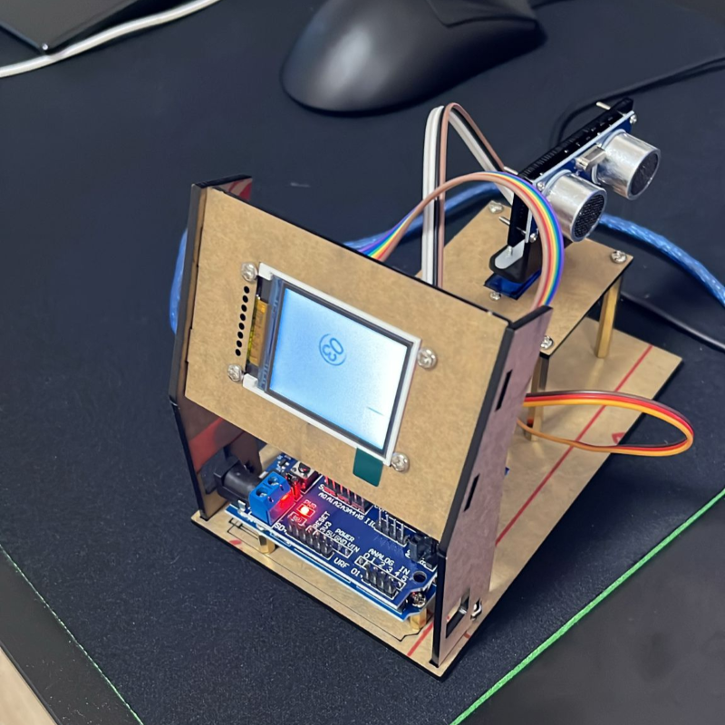
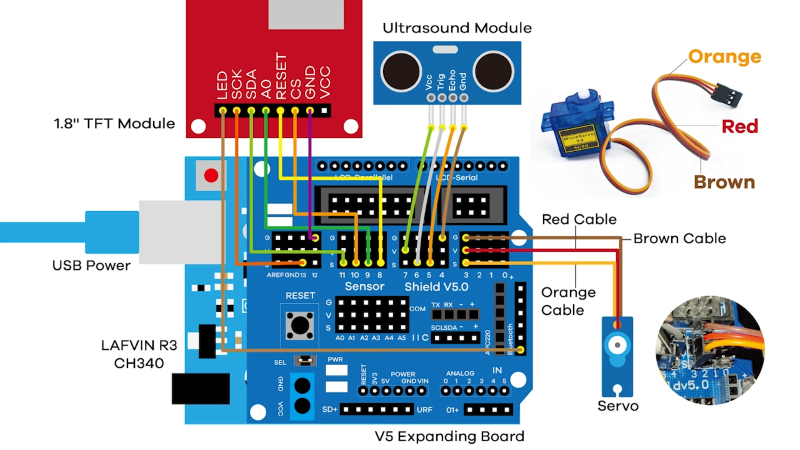

# Z.I.L.G. A.M.R. (Arduino Mini Radar)

Scopul acestui proiect este de a crea un simulator radar ultrasonic care poate detecta si urmari pozitiile obiectelor in timp real pe o raza de 300 cm si un unghi de 180 de grade.

## Functii principale
Masurarea distantei obiectelor si urmarirea directiei folosind rotatia servo-ului si afisarea datelor pe ecranul TFT.

## Planificarea sarcinilor

**Zaharia Ioana**  
✔ Documentare hardware și software;  
✔ Crearea unui plan de implementare si lista de materiale necesare;  
✔ Realizarea cirtuitului;  
✔ Construirea suportului fizic;  
✔ Dezvoltarea interfetei grafice;  
✖ Testare si calibrarea; 

**Luican Gabriel**  
✖ Dezvoltarea codului pentru controlul motorului servo (rotirea servo-ului de la 0 grade la 180 grade);  
✔ Dezvoltarea codului pentru masurarea distantei si returnarea valorilor distantelor corecte;  
✔ Dezvoltarea interfetei grafice;  
✖ Testare si calibrarea;  
✔ Integrarea IoT (configurare hardware si software, dezvoltare software pentru transmiterea datelor).  

## Hardware utilizat pentru proiectul radar IoT

1. Microcontroler -Arduino MEGA 2560,
2. Senzor ultrasonic- HC-SR04,
3. Motor servo MG90S: Motor servo care roteste senzorul ultrasonic in intervalul de 180°,
4. Ecran TFT SPI - se conecteaza prin interfata SPI a microcontrolerului,
5. Module de comunicatie (pentru IoT).

## Instalare
1. [Arduino IDE 2.3.3](https://www.arduino.cc/en/software)
2. [CH430 Driver](https://www.wch-ic.com/downloads/CH341SER_ZIP.html)

## Demo

**VER-1.0.0.0**  

https://github.com/user-attachments/assets/fc83e070-1b88-43fc-a34a-fc0970f18a03

