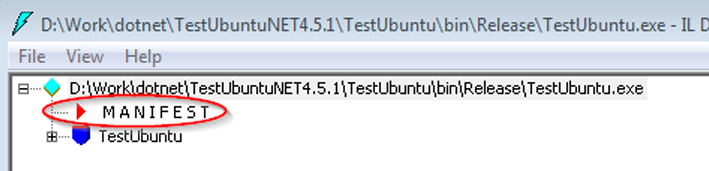
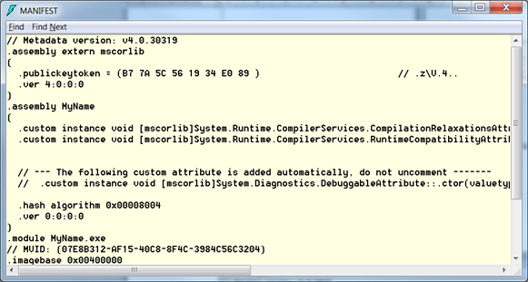

# MAP

## Modulul 1

### TODO 1/7

Folosind aplcatia ildasm.exe, vizualizati codul CIL al unei aplicatii .NET. Care este instructiunea in care se cheama o metoda a unui obiect?

```cs
public void Test([MarshalAs((short)70)] int test) { }
```

```il
// IL from Ildasm.exe output
.method public hidebysig instance void Test(int32  marshal({ 46 }) test) cil managed
```

```il
.class public auto ansi beforefieldinit MyClass
  extends [mscorlib]System.Object
  implements IMyInterface
  {
    .interfaceimpl type IMyInterface
    .custom instance void
      [mscorlib]System.Diagnostics.DebuggerNonUserCodeAttribute::.ctor() = ( 01 00 00 00 )
      …
```

### TODO 2/7

Inspectati un assembly .NET folosind ildasm si determinati numarul de versiune si assembly-urile de care depinde. Aceste metadate se gasesc in seciunea Manifest, precum in imaginea de mai jos:






### TODO 3/7

Care este lista de assemblies care se gaseste pe calculatorul dvs?

```ps
Get-ChildItem -Path "C:\Windows\Microsoft.NET\Framework" -Recurse -Include *.dll
```

```
    Directory: C:\Windows\Microsoft.NET\Framework\v1.0.3705

Mode                 LastWriteTime         Length Name
----                 -------------         ------ ----
-a---           12/7/2019 11:10 AM          96632 mscormmc.dll

    Directory: C:\Windows\Microsoft.NET\Framework\v2.0.50727\1033

Mode                 LastWriteTime         Length Name
----                 -------------         ------ ----
-a---           12/3/2019 11:04 PM          28536 alinkui.dll
-a---           12/3/2019 11:04 PM         145272 cscompui.dll
-a---           12/3/2019 11:04 PM          13688 CvtResUI.dll
-a---           12/3/2019 11:04 PM         192888 vbc7ui.dll
-a---           12/3/2019 11:04 PM         218184 Vsavb7rtUI.dll

...etc
```

#### Test de evaluare 1/2

1. Despre Common Intermediate Language:

a) cunoaste conceptul de polimorfism  
b) este disponibil doar pentru limbajele C# si Visual Basic.NET  
c) este limbaj masina  

> Raspuns:  
a) cunoaste conceptul de polimorfism  

2. Functionalitatile de nivel scazut (precum operatii de intrare/iesire, fire de executie) sunt asigurate de:

a) FCL (Framework Class Library)  
b) CLS (Common Language Specification)  
c) BCL (Base Class Library)  
d) CTS (Common Type System)  

> Raspuns:  
c) CLS (Common Language Specification)  

3. In ce varianta de JIT se face precompilarea intregului cod CIL (Common Intermediate Language)?

a) normal JIT  
b) ecno-JIT  
c) pre-JIT  

> Raspuns:
c) pre-JIT  

4. Din ce se compune un assembly?

a) cod compilat  
b) metadate  
c) intregul cod sursa al aplicatiei  
d) manifest  

> Raspuns:  
a) cod compilat,  
b) metadate,  
c) manifest  

5. Cine se ocupa de dealocarea de memorie?

a) CLS (Common Language Specification)  
b) BCL (Base Class Library)  
c) CTS (Common Type System)  

> Raspuns:  
Niciunul din raspunsurile indicate; delocarea se face de catre Garbage Collection, parte din Common Language Runtime  


### TODO 4/7

Afisati valoarea maxima care se poate reprezenta de catre o variabila de tip int. Indicatie: se foloseste proprietatea MaxValue a tipului int.
```cs
Console.WriteLine($"int.MaxValue={int.MaxValue}");
/*
int.MaxValue=2147483647
*/
```

### TODO 5/7

Pentru tipul enumerare LineStyle definit anterior scrieti o aplicatie care sa afiseze pe ecran campurile pe care le contine.
```cs
Console.WriteLine($"LineStyle.{LineStyle.Solid}, LineStyle.{LineStyle.Dotted}, LineStyle.{LineStyle.DotDash}");
/*
LineStyle.Solid, LineStyle.Dotted, LineStyle.DotDash
*/

```

### TODO 6/7
Varificati daca variabila myJaggedArray poate fi initializata asfel:
```cs
int[][] myJaggedArray = {
  {  1,  3,  5,  7,  9 },
  {  0,  2,  4,  6 },
  { 11, 12 },
};

/*
Error (active)	CS0623	Array initializers can only be used in a variable or field initializer. Try using a new expression instead.
*/

int[,] myJaggedArray2 = {
  {  1,  3,  5,  7,  9 },
  {  0,  2,  4,  6 },
  { 11, 12 },
};

/*
Error (active)	CS0847	An array initializer of length '5' is expected
*/

```

### TODO 7/8

Care este avertismentul care se primeste daca se incearca o atribuire de la valoare double unei variabile de tip int?
```cs
double real = 12.3;
int integer = real;
/*
Error (active)	CS0266	Cannot implicitly convert type 'double' to 'int'. An explicit conversion exists (are you missing a cast?)
*/
```

#### Test de evaluare 2/2

1. Despre tipuri de date:

a) tipurile simple sunt tipuri valoare  
b) un tablou de intregi este un tip valoare  
c) tipurile valoare sunt derivate (direct sau indirect) din tipul obiect  
d) conversia de la tipuri valoare la tipuri referinta este de tip explicit si se numeste boxing  

> Raspuns:  
a) tipurile simple sunt tipuri valoare  
c) tipurile valoare sunt derivate din tipul obiect  
d) ar fi corect daca nu s-ar fi specificat explicit - boxing-ul este conversie implicita  

2. Despre tipul string:  

a) este un tip referinta  
b) este tip predefinit  
c) continutul unei variabile de tip string este imutabil  
d) permite verbatim literal  

> Raspuns:  
a) este un tip referinta  
b) este tip predefinit  
c) continutul unei variabile de tip string este imutabil  
d) permite verbatim literal  

3. Pentru tipurile numerice de mai jos, ce este adevarat?

a) float este alias pentru System.Float si se reprezinta pe 32 de biti  
b) double este alias pentru System.Double si se reprezinta pe 64 de biti  
c) byte este tip intreg cu semn, pe 8 biti  
d) decimal este tip numeric in virgula mobila, reprezentat pe 64 de biti  
e) decimal poate reprezenta NaN  
f) literalii de tip decimal se exprima cu sufixul m sau M  

> Raspuns:  
b) double este alias pentru System.Double si se reprezinta pe 64 de biti  
f) literalii de tip decimal se exprima cu suficul m sau M  

4. Despre tipuri enumerare:

a) sunt tipuri valoare  
b) pot contine doua campuri de nume diferite dar cu aceeasi valoare asociata  
c) pot fi reprezentate prin valori in virgula mobila  
d) pot contine intotdeauna si valori negative  
e) permit conversii implicite la valori numerice intregi (de exemplu, la valoare 1)  

> Raspuns:  
a) sunt tipuri valoare  
b) pot contine doua campuri de nume diferite dar cu aceeasi valoare asociata  

5. Pentru linia:  
```cs
int[,] tab = { { 1, 2, }, { 3, 4 } };
```
Este adevarat?  

a) este incorecta si va genera eroare de compilare  
b) proprietatea Length returneaza valoare 2  
c) proprietatea Length returneaza valoare 4  
d) metoda Length() returneaza valoare 2  
e) metoda Length() returneaza valoare 4  

> Raspuns:  
c) proprietatea Length returneaza valoarea 4  

6. Care din urmatoarele sunt conversii implicite?  

a) de la float la double  
b) de la double la float  
c) de la 0 la orice variabila de tip enumerare  
d) de la un tablou de tip string de 3 elemente la unul de tip object  
e) de la un tablou de tip int de 3 elemente la unul de tip object  

> Raspuns:  
a) de la float la double  
c) de la 0 la orice variabila de tip enumerare  
d) de la un tablou de tip string de 3 elemente la unul de tip object  

7. Pentru secventa:  
```cs
int x = 3;
object y = x;
```
Este adevarat? 

a) eroare la compilare  
b) eroare la rulare  
c) la rulare se poate testa daca in interiorul variabilei y se afla un intreg folosind operatorul 'is'  
d) la rulare se poate testa daca in interiorul variabilei y se afla un intreg folosind operatorul 'as'  
e) nu putem sti la rulare daca y provine din boxing-ul unei valori intregi  

> Raspuns:  
c) la rulare se poate testa daca in interiorul variabilei y se afla un intreg folosind operatorul 'is'  

## Modulul 2

### TODO 1/16

Parcurgeti articolul "Go To Statement Considered Harmful" Edsger W. Dijkstra, Communications of the ACM, Vol. 11, No. 3, March 1968, pp. 147-148.

### TODO 2/16

Scrieti un exemplu de ciclu do ... while pentru care valoarea unei variabile intregi afisata dupa iesirea din ciclu sa fie diferita de ultima valoare a variabilei din executia ciclului.

```cs
int number = 0;

do
{
    ++number;
} while (number < 3);

Console.WriteLine($"number={++number}");

/*
number=4
*/
```

### TODO 3/16

Testati printr-un exemplu ca variabila folosita pentru iterare in cadrul unui foreach nu isi poate schimba valoarea prin instructiune de atribuire  

```cs
int[] numbers = { 1, 2, 3, 4, 5, 6, 7, 8 };

foreach (int number in numbers)
{
    number = number - 1;
}

/*
Error (active)	CS1656	Cannot assign to 'number' because it is a 'foreach iteration variable'
*/
```

### TODO 4/16

Se poate sa declaram un spatiu de nume N1^ in interiorul unuia numit tot N1? Se poate sa declaram spatiul de nume N1 in interiorul spatiului de nume deja existent System?

```cs
using System;

Console.WriteLine($"Nice.Nice.Nice.NiceString={Nice.Nice.Nice.NiceString}");
Console.WriteLine($"System.Nice.NiceSystemString={System.NiceSystem.NiceSystemString}");

namespace Nice
{
    namespace Nice
    {
        class Nice
        {
            public static readonly string NiceString = "Nice.Nice.Nice.Nice";
        }
    }
}

namespace System
{
    class Nice
    {
        public static readonly string NiceSystemString = "System.Nice.Nice";
    }
}

/*
Nice.Nice.Nice.NiceString=Nice.Nice.Nice.Nice
System.Nice.NiceSystemString=System.Nice.Nice
*/
```

### TODO 5/16

Scrieti o metoda care primeste un parametru de tip tablou de intregi unidimensional, astfel incat la revenire din apel variabila trimisa din apel sa aiba cu 1 element mai mult

```cs
static void AddElement(ref int[] numbers, int newElement) {
    Array.Resize(ref numbers, numbers.Length + 1);
    numbers[numbers.Length - 1] = newElement;
}

int[] numbers = { 1, 2, 3, 4, 5, 6, 7, 8 };
int beforeLength = numbers.Length;

AddElement(ref numbers, 9);

int afterLength = numbers.Length;

Console.WriteLine($"beforeLength={beforeLength}, afterLength={afterLength}");

/*
beforeLength=8, afterLength=9
*/
```

### TODO 6/16

Notati diferentele dintre directiva using ca alias si directiva using pentru import simbolic

Directiva using ca alias este folosita pentru a crea nume alternative pentru namespace-uri sau tipuri, in timp ce directiva using pentru import simbolic este utilizată pentru a importa membri statici in toate fisierele sursa.

```cs
// Directiva using ca alias
using TextBoxForms = System.Windows.Forms.TextBox;
using TextBoxWeb = System.Web.UI.WebControls.TextBox;
```

```cs
// Directiva using pentru import simbolic
using static System.Math;
```

#### Test de evaluare a cunostinelor 1/1

1. Despre instructiuni de selectie:

a) codul de mai jos genereaza eroare de compilare  
```cs
if (3) {
  Console.WriteLine("Hello, world!");
}

/*
Error (active)	CS0029	Cannot implicitly convert type 'int' to 'bool'
*/
```
b) o ramura case poate sa nu se incheie cu break, chiar daca contine macar o instructiune  
c) in instructiunea switch este permis ca expresia tastata sa fie un sir de caractere  
d) ramura default din cadrul unei instructiuni switch poate fi prima din bloc 
e) putem intalni instructiunea goto default;  

> Raspuns:  
a) codul de mai jos genereaza eroare de compilare  
b) o ramura case poate sa nu se incheie cu break, chiar daca contine macar o instructiune  
c) in instructiunea switch este permis ca expresia tastata sa fie un sir de caractere  
d) ramura default din cadrul unei instructiuni switch poate fi prima din bloc  
e) putem intalni instructiunea goto default;  

2. Care este instructiunea care determina salt peste restul instructiunilor dintr-un ciclu si continuarea de la urmatoare ciclare?

a) break  
b) return  
c) if  
d) case  
e) continue  
f) return  

> Raspuns:  
e) continue  

3. Varificarea din cadrul blocului checked se efectueaza la:

a) doar la compilare  
b) doar la rulare  
c) atat la compilare, cat si la rulare  

> Raspuns:  
b) doar la rulare  

4. Care este metoda care se apeleaza automat la finalul blocului unei instructiuni using?

a) Delete()  
b) Close()  
c) Exit()  
d) Deallocate()  
e) nu exista instructiunea using  

> Raspuns:  
Niciun raspuns din cele indicate; metoda referita este Dispose();  

5. Gradul de vizibilitate implicit al unei clase declarate intr-un spatiu de nume este:

a) public  
b) private  
c) protected  
d) internal  
e) protected internal  

> Raspuns:  
d) internal  

6. In C# transmiterea de parametri se face implicit prin:

a) valoare  
b) referinta, prin ref  
c) referinta, prin out  
d) variabilele de tip valoare se transmit prin valoare, cele de tip referinta prin referinta  

> Raspuns:  
d) variabilele de tip valoare se transmit prin valoare, cele de tip referinta prin referinta  


### TODO 7/16

Care este eroarea afisata la incercarea de accesare a unui camp static prin intermediul unui obiect?  

```cs
/*
Error (active)	CS0176	Member 'Vector2.X' cannot be accessed with an instance reference; qualify it with a type name instead
*/
namespace Map
{
    public class Vector2
    {
        private static float _x;
        private static float _y;

        public static float X
        {
            get
            {
                return _x;
            }

            set
            {
                if (_x != value)
                {
                    _x = value;
                }
            }
        }

        public static float Y
        {
            get
            {
                return _y;
            }

            set
            {
                if (_y != value)
                {
                    _y = value;
                }
            }
        }

        public Vector2(float x, float y)
        {
            _x = x;
            _y = y;
        }
        public static void Scale(float factor)
        {
            _x *= factor;
            _y *= factor;
        }
    }

    public class MapProgram
    {
        private static void Main(string[] args)
        {
            Vector2 point = new(1.2f, 3.4f);
            point.X = 0.1f;


        }
    }
}
```

### TODO 8/16

Ce eroare de compilare apare daca se declara un camp constant de tipul clasei A? Ce eroare apare daca se declara un camp constant de tip int, dar fara sa i se specifice o valoare intiala?

```cs
/*
Error (active)	CS0145	A const field requires a value to be provided
*/

const A thing;
const int num;

class A
{
    const int PROP = 2;
}
```

### TODO 9/16

Verificati daca plecand de la un obiect se poate face apel de metoda statica declarata pentru clasa obiectului

```cs
/*
Error (active)	CS0176	Member 'Thing.Exist()' cannot be accessed with an instance reference; qualify it with a type name instead
*/

Thing thing = new Thing();

thing.Exist();

class Thing
{
    public static void Exist()
    {
        Console.WriteLine("A thing exists.");
    }
}
```

### TODO 10/16

Proprietatea Length a unei variabile sir de caractere permite modificarea lungimii sirului? Cum a fost declarata proprietatea, in acest sens?

```cs
/*

Error (active)	CS0200	Property or indexer 'string.Length' cannot be assigned to -- it is read only
*/

string word = "Fun";

word.Length = 600;
```

### TODO 11/16

Implementati un control utilizator dupa modelul de mai sus si utiliati-l intr-o forma Windows.

```cs
using System;
using System.Collections.Generic;
using System.ComponentModel;
using System.Linq;
using System.Text;
using System.Threading.Tasks;
using System.Windows;
using System.Windows.Controls;
using System.Windows.Data;
using System.Windows.Documents;
using System.Windows.Input;
using System.Windows.Media;
using System.Windows.Media.Animation;
using System.Windows.Media.Imaging;
using System.Windows.Navigation;
using System.Windows.Shapes;

namespace Learning.Views
{
    public partial class ThingUserControl : UserControl
    {

        private Label _streetLabel;
        private TextBox _streetTextBox;

        private Label _numberLabel;
        private TextBox _numberTextBox;

        private Label _phoneLabel;
        private TextBox _phoneTextBox;

        public ThingUserControl()
        {
            InitializeComponent();

            _streetLabel = new Label();
            _streetTextBox = new TextBox();

            _numberLabel = new Label();
            _numberTextBox = new TextBox();

            _phoneLabel = new Label();
            _phoneTextBox = new TextBox();

            _streetLabel.Name = "streetLabel";
            _streetLabel.TabIndex = 0;
            _streetLabel.Content = "Street";
            _streetLabel.Width = 16;
            _streetLabel.Height = 8;
            _streetTextBox.Name = "streetTextBox";
            _streetTextBox.TabIndex = 1;
            _streetTextBox.Text = "";
            _streetTextBox.Width = 48;
            _streetTextBox.Height = 8;

            _numberLabel.Name = "numberLabel";
            _numberLabel.TabIndex = 2;
            _numberLabel.Content = "Number";
            _numberLabel.Width = 48;
            _numberLabel.Height = 8;
            _numberTextBox.Name = "numberTextBox";
            _numberTextBox.TabIndex = 3;
            _numberTextBox.Text = "";
            _numberTextBox.Width = 48;
            _numberTextBox.Height = 8;

            _phoneLabel.Name = "phoneLabel";
            _phoneLabel.TabIndex = 4;
            _phoneLabel.Content = "Phone";
            _phoneLabel.Width = 48;
            _phoneLabel.Height = 8;
            _phoneTextBox.Name = "phoneTextBox";
            _phoneTextBox.TabIndex = 5;
            _phoneTextBox.Text = "";
            _phoneTextBox.Width = 48;
            _phoneTextBox.Height = 8;
        }

        [Category ("Data"), Description ("Contents of Street Control")]
        public string Street
        {
            get
            {
                return _streetTextBox.Text;
            }
            set
            {
                _streetTextBox.Text = value;
            }
        }

        [Category ("Data"), Description ("Content of Number Control")]
        public string Number
        {
            get
            {
                return _numberTextBox.Text;
            }
            set
            {
                _numberTextBox.Text = value;
            }
        }

        [Category("Data"), Description("Content of Phone Control")]
        public string Phone
        {
            get
            {
                return _phoneTextBox.Text;
            }
            set
            {
                _phoneTextBox.Text = value;
            }
        }
    }
}

```

### TODO 12/16

Scrieti un exemplu prin care sa se arata ca pentru o clasa derivata, constructorul clasei de baza se apeleaza inaintea clasei derivate

```cs
DerivedThing derivedThing = new DerivedThing();

class ThingBase
{
    public ThingBase()
    {
        Console.WriteLine("ThingBase :: Called Constructor");
    }
}

class DerivedThing : ThingBase
{
    public DerivedThing()
    {
        Console.WriteLine("DerivedThing :: Called Constructor");
    }
}

/*
ThingBase :: Called Constructor
DerivedThing :: Called Constructor
*/
```

### TODO 13/16

Gasiti justificare pentru care s-ar dori ca o clasa sa fie declarata sealead

Dacă o clasă conține informații sensibile (cum ar fi parole, chei criptografice sau alte date confidențiale), putem să o marcăm ca sealed. Astfel, împiedicăm orice moștenire a clasei și evităm posibilitatea ca cineva să creeze o subclasă care să compromită securitatea.

Uneori, o clasă poate avea multe metode virtuale sau suprascrise. Sigilarea clasei (marcarea ei ca sealed) spune runtime-ului că nu trebuie să caute mai jos în ierarhia de moștenire pentru alte metode. Acest lucru poate îmbunătăți performanța.
Multe instrumente de optimizare de performanță oferă o opțiune pentru a sigila automat toate clasele care nu sunt moștenite. Aceasta poate fi utilă pentru a evita costurile de căutare în timpul rulării.

Dacă proiectăm o clasă utilitară cu un comportament fix (de exemplu, o clasă matematică cu funcții trigonometrice), putem să o marcăm ca sealed. Astfel, ne asigurăm că nu va fi modificată sau extinsă accidental.

### TODO 14/16

Implementati exemplul ce urmeaza. Folositi rularea pas cu pas pentru a verifica succesiunea de metode efectiv executate.

```cs
Console.WriteLine("First block  -  Start");
Above[] x = new Above[4];
Console.WriteLine("First block  -    End\n");

Console.WriteLine("Second block -  Start");
x[0] = new Above();
x[1] = new Below();
x[2] = new Child();
x[3] = new Deriv();
Console.WriteLine("Second block -    End\n");

Console.WriteLine("Third block  -  Start");
Above a = new Above();
Below b = new Below();
Child c = new Child();
Deriv d = new Deriv();
Console.WriteLine("Third block  -    End\n");

Console.WriteLine("For loop     -  Start");
for (int i = 0; i < 4; ++i)
{
    x[i].Fun();
}
Console.WriteLine("For loop     -    End\n");

Console.WriteLine("Last block   -  Start");
a.Fun();
b.Fun();
c.Fun();
d.Fun();
Console.WriteLine("Last block   -    End\n");

class Above
{
    public virtual void Fun()
    {
        Console.WriteLine("Above :: Called Fun()");
    }
}

class Deriv : Above
{
    public override void Fun()
    {
        Console.WriteLine("Deriv :: Called Fun()");
    }
}

class Below : Above
{
    public override void Fun()
    {
        Console.WriteLine("Below :: Called Fun()");
    }
}

class Child : Below
{
    public override void Fun()
    {
        Console.WriteLine("Child :: Called Fun()");
    }
}

/*
First block  -  Start
First block  -    End

Second block -  Start
Second block -    End

Third block  -  Start
Third block  -    End

For loop     -  Start
Above :: Called Fun()
Below :: Called Fun()
Child :: Called Fun()
Deriv :: Called Fun()
For loop     -    End

Last block   -  Start
Above :: Called Fun()
Below :: Called Fun()
Child :: Called Fun()
Deriv :: Called Fun()
Last block   -    End
*/

```

### TODO 15/16

Este posibil ca o clasa abstracta sa aiba constructor cu implementare? Cum explicati? Construiti un exemplu care sa probeze afirmatia dvs.

O clasă abstractă poate avea un constructor cu implementare (adică un constructor care are corpul definit).

Constructorul dintr-o clasă abstractă poate fi folosit pentru a inițializa membrii clasei sau pentru a executa alte operații necesare la crearea obiectelor.

Constructorul dintr-o clasă abstractă nu poate fi apelat direct (deoarece nu putem crea obiecte direct dintr-o clasă abstractă), dar poate fi apelat indirect prin intermediul claselor derivate.

```cs
abstract class Point
{
    protected int _x;
    protected int _y;
    public Point(int x, int y)
    {
        Console.WriteLine("Idea :: Called constructor");
        _x = x;
        _y = y;
    }

    public abstract void MapToCoordinates(int xNew, int yNew);
}

class Vector2 : Point
{
    public Vector2(int x, int y) : base(x, y)
    {

    }

    public override void MapToCoordinates(int xNew, int yNew)
    {
        _x = xNew;
        _y = yNew;
    }
}
```

### TODO 16/16

Cum explicati faptul ca o clasa de tip WPF este declarata ca fiind partiala in Visual Studio? Care sunt beneficiile separarii in doua fisiere: unul de design, altul de cod pentru implementare?

O clasă parțială este o clasă care poate fi definită în mai multe fișiere separate.

Toate aceste fișiere contribuie la aceeași clasă, iar compilatorul le combină într-o singură entitate.

Fiecare fișier parțial conține o parte din implementarea clasei, dar toate trebuie să aibă același nume.

Beneficiile claselor parțiale în WPF:
a. Separarea design-ului de cod: - În WPF, o clasă parțială poate fi utilizată pentru a separa design-ul (interfața vizuală) de codul de implementare. - Fișierul de design (XAML) conține structura vizuală a elementelor UI (butoane, ferestre, controale etc.). - Fișierul de cod (C#) conține logica de interacțiune, gestionarea evenimentelor și alte aspecte de implementare.

b. Mentinerea organizată și ușurința de citire: - Separarea design-ului de cod face ca fiecare fișier să fie mai concis și să se concentreze pe un aspect specific al clasei. - Dezvoltatorii pot lucra independent pe fiecare parte (design sau cod) fără a afecta celălalt aspect. - Acest lucru face codul mai ușor de citit, de întreținut și de gestionat.

c. Extensibilitate și colaborare: - Clasele parțiale facilitează colaborarea între designeri și dezvoltatori. - Designerii pot lucra pe fișierele XAML, adăugând elemente vizuale și stiluri, în timp ce dezvoltatorii pot implementa logica în fișierele C#. - Această separare permite extinderea și modificarea interfeței fără a afecta logica de cod.

d. Generarea automată de cod: - Un exemplu comun este generarea automată de cod de către Visual Studio. - De exemplu, atunci când adăugăm un eveniment (cum ar fi un click pe un buton) în fișierul XAML, Visual Studio generează automat metoda corespunzătoare în fișierul C#.

#### Test de evaluare 1/2

1. Care este gradul implicit al unui membru intr-o clasa?

a) private  
b) protected  
c) internal  
d) protected internal  
e) public  

> Raspuns:  
a) private  

2. Ce este adevarat despre clasele statice?

a) pot fi partiale  
b) pot avea constructor instanta  
c) pot avea constructor static calificat ca public  
d) pot avea destructor  
e) pot contine indexatori statici  
f) pot contine proprietati statice  

> Raspuns:  
a) pot fi partiale  
f) pot contine proprietati statice  

3. Ce este adevarat?

a) o clasa abstracta nu poate implementa o interfata  
b) o clasa abstracta nu poate avea destructor  
c) o clasa abstracta poate avea metode cu implementare  
d) o clasa abstracta e automat si sealead  
e) orice clasa este tip referinta  

> Raspuns:  
c) o clasa abstracta poate avea metode cu implementare  
e) orice clasa este tip referinta  

4. Despre proprietati in cadrul claselor:

a) pot fi declarate statice  
b) pot fi declarate ca abstracte in clase abstracte  
c) pot avea get public si set privat  

> Raspuns:  
a) pot fi declarate statice  
b) pot fi declarate ca abstracte in clase abstracte  
c) pot avea get public si set privat  

```cs
public abstract class Shape
{
    public abstract double Aria { get; }
}
```

#### Test de evaluare 2/2

1. Ce se pot declara in interfete?

a) campuri  
b) evenimente  
c) constructori de instanta  
d) constructor static  
e) destructor  
f) metode  

> Raspuns:  
b) evenimente  
f) metode  

2. Care este gradul de acces implicit al metodelor din cadrul interfetelor?

a) public  
b) private  
c) protected  
d) internal  
e) protected internal  

> Raspuns:  
a) public  

3. Relativ la structuri:

a) din ele se pot deriva alte tipuri de date  
b) sunt derivate direct din System.ValueType  
c) permit definirea unui constructor static  
d) permit definirea unui destructor  
e) nu pot contine indexatori  

> Raspuns:  
b) sunt derivate direct din System.ValueType  
c) permit definirea unui constructor static  


4. Ce este adevarat despre clase abstracte:

a) exista cel putin un caz in care pot contine metoda calificata override  
b) pot declara evenimente  
c) pot fi derivate din mai multe clase, simultan  
d) pot declara ca implementeaza mai multe interfete  

> Raspuns:  
a) exista cel putin un caz in care pot contine metoda calificata override  
b) pot declara evenimente  
d) pot declara ca implementeaza mai multe interfete  

## Modulul 3

### TODO 1/3

Sugeram cititorului interesat urmarirea pas cu pas a executiei aplicatiei pentru a vedea metodele care se aplica.

```cs
MyDelegate deleg;

deleg = Sum;

Console.WriteLine($"Sum={Callback(3, 4, deleg)}");

deleg = Sub;

Console.WriteLine($"Sub={Callback(3, 4, deleg)}");

Console.WriteLine($"Mul={Callback(3, 4, Mul)}");

Console.WriteLine($"Div={OtherCallback(3, 4, Div)}");


int Sum(int a, int b)
{
    return a + b;
}

int Sub(int a, int b)
{
    return a - b;
}

int Mul(int a, int b)
{
    return a * b;
}

float Div(int a, int b)
{
    return a / (float) b;
}

int Callback(int a, int b, MyDelegate deleg)
{
    return deleg(a, b);
}

float OtherCallback(int a, int b, OtherDelegate otherDeleg)
{
    return otherDeleg(a, b);
}

delegate int MyDelegate(int a, int b);

delegate float OtherDelegate(int a, int b);

```

### TODO 2/3

Implementati exemplul de mai sus si verificati-i comportamentul in timpul rularii pas cu pas.

```cs
Something something = new Something();

something.InvokeMethod();

SomethingElse somethingElse = new SomethingElse();

somethingElse.InvokeMethod();

class Something
{
    delegate void SomeDelegate();

    public void InvokeMethod()
    {
        SomeDelegate deleg = new SomeDelegate(SomeMethod);
        deleg();
    }

    private void SomeMethod()
    {
        Console.WriteLine("Something :: SomeMethod()");
    }
}

class SomethingElse
{
    delegate void SomeOtherDelegate();

    public void InvokeMethod()
    {
        SomeOtherDelegate deleg = delegate ()
        {
            Console.WriteLine("SomethingElse :: InvokeMethod()");
        };
        deleg();
    }
}
```

#### Test de evaluare 1/x

1. Tipurile delegat:

a) sunt tipuri valoare  
b) sunt tipuri referinta  
c) sunt tipuri structura  
d) se pot declara doar in interiorul claselor  
e) se pot declara in interiorul interfetelor  

> Raspuns:  
b) sunt tipuri referinta  
e) se pot declara in interiorul interfetelor  

2. Ce inseamna multicast?

a) un anumit tip de delegat  
b) o inlantuire de conversii de tip    
c) un tip delegat fara parametri de apel  
d) un tip de metoda  

> Raspuns:  
a) un anumit tip de delegat  


### TODO 3/3

Implementati exemplul de mai sus. Modificati exemplul astfel incat sa se opreasca executia automat dupa 1 minut.

```cs

Clock clock = new Clock();

DisplayClock dc = new DisplayClock();
dc.Subscribe(clock);

LogCurrentTime lct = new LogCurrentTime();
lct.Subscribe(clock);

clock.Run();


public class TimeInfoEventArgs : EventArgs
{
    public readonly int Hour;
    public readonly int Minute;
    public readonly int Second;

    public TimeInfoEventArgs(int hour, int minute, int second)
    {
        Hour = hour;
        Minute = minute;
        Second = second;
    }
}

public class DisplayClock
{
    public void Subscribe(Clock clock)
    {
        clock.OnSecondChange += new Clock.SecondChangeHandler(TimeHasChanged);
    }

    private void TimeHasChanged(object sender, TimeInfoEventArgs e)
    {
        Console.WriteLine($"Current Time: {e.Hour}:{e.Minute}:{e.Second}");
    }
}

public class LogCurrentTime
{
    public void Subscribe(Clock clock)
    {
        clock.OnSecondChange += new Clock.SecondChangeHandler(WriteLogEntry);
    }

    private void WriteLogEntry(object sender, TimeInfoEventArgs e)
    {
        Console.WriteLine($"Logging Time: {e.Hour}:{e.Minute}:{e.Second}");
    }
}

public class Clock
{
    public delegate void SecondChangeHandler(object sender, TimeInfoEventArgs e);

    public event SecondChangeHandler OnSecondChange;

    private int _hour;
    private int _minute;
    private int _second;

    public void Run()
    {
        DateTime prevTime = DateTime.Now;
        _hour = prevTime.Hour;
        _minute = prevTime.Minute;
        _second = prevTime.Second;

        while (true)
        {
            DateTime currTime = DateTime.Now;

            if (currTime.Second != _second)
            {
                TimeInfoEventArgs timeInfo = new TimeInfoEventArgs(currTime.Hour, currTime.Minute, currTime.Second);

                if (OnSecondChange != null)
                {
                    OnSecondChange(this, timeInfo);
                }

                TimeSpan elapsed = currTime - prevTime;

                if (elapsed.TotalSeconds >= 60)
                {
                    Console.WriteLine($"One minute has passed. Terminating . . .");
                    break;
                }
            }

            _hour = currTime.Hour;
            _minute = currTime.Minute;
            _second = currTime.Second;
        }
    }
}

/*
Current Time: 11:30:32
Current Time: 11:30:33
Current Time: 11:30:34
Current Time: 11:30:35
Current Time: 11:30:36
Current Time: 11:30:37
Current Time: 11:30:38
Current Time: 11:30:39
Current Time: 11:30:40
Current Time: 11:30:41
Current Time: 11:30:42
Current Time: 11:30:43
Current Time: 11:30:44
Current Time: 11:30:45
Current Time: 11:30:46
Current Time: 11:30:47
Current Time: 11:30:48
Current Time: 11:30:49
Current Time: 11:30:50
Current Time: 11:30:51
Current Time: 11:30:52
Current Time: 11:30:53
Current Time: 11:30:54
Current Time: 11:30:55
Current Time: 11:30:56
Current Time: 11:30:57
Current Time: 11:30:58
Current Time: 11:30:59
Current Time: 11:31:0
Current Time: 11:31:1
Current Time: 11:31:2
Current Time: 11:31:3
Current Time: 11:31:4
Current Time: 11:31:5
Current Time: 11:31:6
Current Time: 11:31:7
Current Time: 11:31:8
Current Time: 11:31:9
Current Time: 11:31:10
Current Time: 11:31:11
Current Time: 11:31:12
Current Time: 11:31:13
Current Time: 11:31:14
Current Time: 11:31:15
Current Time: 11:31:16
Current Time: 11:31:17
Current Time: 11:31:18
Current Time: 11:31:19
Current Time: 11:31:20
Current Time: 11:31:21
Current Time: 11:31:22
Current Time: 11:31:23
Current Time: 11:31:24
Current Time: 11:31:25
Current Time: 11:31:26
Current Time: 11:31:27
Current Time: 11:31:28
Current Time: 11:31:29
Current Time: 11:31:30
Current Time: 11:31:31
Current Time: 11:31:32
One minute has passed. Terminating . . .
*/

```

#### Test de evaluare 1/1

1. Un eveniment poate fi tratat printr-o metoda:

a) de orice tip  
b) intotdeauna publica  
c) compatibilita cu orice tip delegat  

> Raspuns:  
Niciunul din raspunsurile furnizate; raspunsul corect este 'delegat multicast'  

2. Subscrierea la un eveniment se face folosind:

a) metoda Subscribe()  
b) metoda subscribe()  
c) un constructor  

> Raspuns:  
Niciunul din raspunsuri; subscrierea se face cu operatorul +=  

3. Despre evenimente:

a) pot fi declarate in interiorul interfetelor  
b) pot fi declarate in interiorul claselor  
c) pot fi declarate direct intr-un spatiu de nume  
d) pot fi declarate in interiorul tipurilor enumerare  
e) pot fi declarate in interiorul tipurilor structura  

> Raspuns:  
a) pot fi declarate in interiorul interfetelor  
b) pot fi declarate in interiorul claselor  
c) pot fi declarate direct intr-un spatiu de nume  
e) pot fi declarate in interiorul tipurilor structura  

## Modulul 4

### TODO 1/8

Este posibil ca pentru o metoda ce returneaza un tip oarecare (nu void), in bloc finally sa se includa instructinea return? Cum explicati?

Blocul finally este executat întotdeauna, indiferent dacă o excepție a fost aruncată sau nu.

Dacă o excepție este aruncată în blocul try, codul din blocul finally se execută înainte de a se propaga excepția mai departe.

Dacă nu există excepții, blocul finally se execută după ce blocul try a terminat execuția.

Dacă includem o instrucțiune return în blocul finally, aceasta va suprascrie orice valoare de returnare stabilită în blocul try.

În esență, valoarea de returnare din blocul finally va fi întotdeauna cea care va fi returnată, indiferent de ce s-a întâmplat în blocul try.

Dacă am permite o instrucțiune return în blocul finally, ar putea duce la comportamente confuze și greu de anticipat.

Ar fi dificil să ne așteptăm la o valoare de returnare specifică când blocul finally poate modifica această valoare.

### TODO 2/8

Implementati si executati pas cu pas exemplul de mai jos

```cs


public class MyCustomException : ApplicationException
{
    public MyCustomException(string message) : base(message)
    {

    }

    public MyCustomException(string message, Exception innterException) : base(message, innterException)
    {

    }
}

public class Test
{
    public static void Main()
    {
        Test t = new Test();
        t.TestFunc();
        t.TestDangerousFunc();
    }

    public void TestFunc()
    {
        try
        {
            double a = 0;
            double b = 5;
            Console.WriteLine($"{a}/{b} = {Divide(a, b)}");
        }
        catch (MyCustomException e)
        {
            Console.WriteLine(e.Message);
        }
        catch
        {
            Console.WriteLine("Test :: TestFunc() :: Caught unknown exception.");
        }
    }

    public void TestDangerousFunc()
    {
        try
        {
            DangerousFunc1();
        }
        catch (MyCustomException e)
        {
            Console.WriteLine(e.Message);
            Console.WriteLine("Test :: TestDangerousFunc() :: Retrieving exception history. . .");
            Exception? inner = e.InnerException;

            while (inner != null)
            {
                Console.WriteLine(inner.Message);
                inner = inner.InnerException ?? null;
            }
        }
    }

    public double Divide( double numerator, double denominator )
    {
        if (denominator == 0)
        {
            DivideByZeroException e = new DivideByZeroException();
            e.HelpLink = "https://learn.microsoft.com/en-us/dotnet/api/system.dividebyzeroexception?view=net-8.0";
            throw e;
        }

        if (numerator == 0)
        {
            MyCustomException e = new MyCustomException("This method does not accept 0 as numerator.");
            e.HelpLink = "";
            throw e;
        }

        return numerator / denominator;
    }

    public void DangerousFunc1()
    {
        try
        {
            DangerousFunc2();
        }
        catch (Exception e)
        {
            MyCustomException ex = new MyCustomException("Test :: DangerousFunc1() :: E3 - Caught Custom Exception", e);
            throw ex;
        }
    }

    public void DangerousFunc2()
    {
        try
        {
            DangerousFunc3();
        }
        catch(DivideByZeroException e)
        {
            Exception ex = new Exception("Test :: DangerousFunc2() :: E2 - Caught Divide by Zero Exception", e);
            throw ex;
        }
    }

    public void DangerousFunc3()
    {
        try
        {
            DangerousFunc4();
        }
        catch (ArithmeticException e)
        {
            throw;
        }
        catch (Exception e)
        {
            Console.WriteLine("Test :: DangerousFunc3() :: Exception handled here.");
        }
    }

    public void DangerousFunc4()
    {
        throw new DivideByZeroException("Test :: DangerousFunc4() :: E1 - DivideByZero Exception.");
    }
}
```

### TODO 3/3

Urmariti discutia dintre Anders Heilsberg si Bruce Eckel pe tema check/unchecked exceptions de la adresa: 404 Page not found

#### Test de evaluare 1/3

1. Despre tipurile exceptie:

a) sunt tipuri valoare  
b) sunt tipuri referinta  
c) se deriveaza intotdeauna direct din tipul Exception  
d) se declara ca fiind aruncate de catre metodele in care pot aparea  

> Raspuns:  
b) sunt tipuri referinta  

2. Relativ la obiectele exceptie:  

a) continutul lor se stocheaza pe stiva  
b) pot contine alte obiecte de tip exceptie  
c) permit determinarea sirului de apeluri de metode care a dus la aparitia lor  
d) pot fi rearuncate  
e) se prind si se trateaza intr-un bloc finally  

> Raspuns:  
b) pot contine alte obiecte de tip exceptie 
c) permit determinarea sirului de apeluri de metode care a dus la aparitia lor  
d) pot fi rearuncate  

3. Ce este corect legat de exceptii?

a) pot fi aruncate din constructori  
b) nu pot fi aruncate din destructori  
c) daca nu sunt aruncate, intotdeauna opresc executia intregii aplicatii  
d) cele definite de programator pot contine proprietati calificate cu override  

> Raspuns:  
a) pot fi aruncate din constructori  
d) cele definite de programator pot contine proprietati calificate de override  

### TODO 4/8

Verificati ca intr-un obiect de tip ArrayList se pot depune consecutiv obiecte de tip int, String, tablou.

```cs
using System.Collections;

ArrayList arrayList = new ArrayList();

arrayList.Add(1);
arrayList.Add(2);
arrayList.Add("One");
arrayList.Add("Two");
arrayList.Add(new int[] { 1, 2 });
arrayList.Add(new string[] { "One", "Two" });

foreach (var v in arrayList)
{
    Console.WriteLine(v.ToString());
}

ArrayList arrayList2 = [
    3, 4,
    "Three", "Four",
    new int[] { 1, 2 },
    new string[]{ "One", "Two" },
    ];

```

### TODO 5/8

Implementati si rulati exemplele de mai sus.

```cs
using System.Collections;

Hashtable hashtable = new Hashtable();
hashtable.Add("A", "Chapter I");
hashtable.Add("B", "Chapter II");
hashtable.Add("App", "Appendix");

IDictionaryEnumerator en = hashtable.GetEnumerator();

for (; en.MoveNext(); )
{
    Console.WriteLine($"key={en.Key}, value={en.Value}");
}

foreach (DictionaryEntry entry in hashtable)
{
    Console.WriteLine($"key={entry.Key}, value={entry.Value}");
}

```

### TODO 6/8

```cs
using System.Collections;


class TreeNode<T>
{
    private T _value;
    public T Value
    {
        get
        {
            return _value;
        }
        set
        {
            _value = value;
        }
    }

    private TreeNode<T> _left;
    public TreeNode<T> Left
    {
        get
        {
            return _left;
        }
        set
        {
            _left = value;
        }
    }

    private TreeNode<T> _right;
    public TreeNode<T> Right
    {
        get
        {
            return _right;
        }
        set
        {
            _right = value;
        }
    }
}

class Tree<T>
{
    private TreeNode<T> _root;

    public void AddValues(params T[] val)
    {
        Array.ForEach(val, Add);
    }

    public IEnumerable<T> InOrder()
    {
        return InOrder(_root);
    }

    public IEnumerable<T> PreOrder()
    {
        return PreOrder(_root);
    }

    private IEnumerable<T> InOrder(TreeNode<T> node)
    {
        if (node.Left != null)
        {
            foreach (T val in InOrder(node.Left))
            {
                yield return val;
            }
        }

        yield return node.Value;

        if (node.Right != null)
        {
            foreach (T val in InOrder(node.Right))
            {
                yield return val;
            }
        }
    }

    private IEnumerable<T> PreOrder(TreeNode<T> node)
    {
        yield return node.Value;

        if (node.Left != null)
        {
            foreach (T val in PreOrder(node.Left))
            {
                yield return val;
            }
        }

        if (node.Right != null)
        {
            foreach (T val in PreOrder(node.Right))
            {
                yield return val;
            }
        }
    }

    private void Add(T val)
    {

    }
}
```

#### Test de evaluare 2/3

1. Ce conditie trebuie sa indeplineasca o clasa pentru ca peste o instanta a sa sa se poata itera cu instructiunea foreach?

a) sa implementeze interfata ICollection  
b) sa contina o colectie de valori  
c) sa implementeze interfata IEnumerable  
d) sa implementeze interfata CollectionBase  

> Raspuns:  
c) sa implementeze interfata IEnumerable  

2. Ce tip de date implementeaza politica de access 'primul intrat - primul iesit'?  

a) ArrayList  
b) BitArray  
c) Stack  
d) Queue  

> Raspuns:  
d) Queue  

3. Care sunt diferentele dintre SortedList si HashTable?  

a) SortedList mentine o lista sortata de elemente, pe cand HashTable este o colectie de perechi de elemente  
b) SortedList mentine o colectie de perechi sortate dupa valoare, pe cand HashTable nu le sorteaza  
c) SortedList mentine o colectie de perechi sortate dupa cheie, pe cand HashTable nu le sorteaza  
d) nu e nici o diferenta, dar SortedList este implementat in versiuni mai recente ale platformei .NET

> Raspuns:  
c) SortedList mentine o colectie de perechi sortate dupa cheie, pe cand HashTable nu le sorteaza

### TODO 7/8

Implementati exemplul de mai sus in Visual Studio

```cs
Point<int> u = new Point<int>(10, 10);
Point<double> v = new Point<double>(1.2, 3.4);

Console.WriteLine(u);
Console.WriteLine(v);

u.Reset();
v.Reset();

Console.WriteLine(u);
Console.WriteLine(v);

struct Point<T>
{
    private T _x;
    private T _y;

    public T X { get { return _x; } set { _x = value; } }
    public T Y { get { return _y; } set { _y = value; } }

    public Point(T x, T y) 
    { 
        _x = x; 
        _y = y;
    }

    public override string ToString()
    {
        return string.Format("({0}, {1})", _x.ToString(), _y.ToString());
    }

    public void Reset()
    {
        _x = default(T);
        _y = default(T);
    }
}
```

### TODO 8/8

Implementati in Visual Studio exemplul de mai sus

```cs
Student s1 = new Student();
s1.Name = "B";
s1.AverageGrade = 3;

Student s2 = new Student();
s2.Name = "A";
s2.AverageGrade = 5;

Student s3 = new Student();
s3.Name = "C";
s3.AverageGrade = 1;

List<Student> students = new List<Student>();

students.Add(s1);
students.Add(s2);
students.Add(s3);

Display("Original data:", students);

students.Sort(new ComparerStudentName());
Display("Sorted by name:", students);

students.Sort(new ComparerStudentGrade());
Display("Sorted by grade:", students);

ComparerStudentName comp = new ComparerStudentName();
Console.WriteLine($"Student '{s1.Name}' appears on position {students.BinarySearch(s1, comp)}");

static void Display(string message, List<Student> students)
{
    Console.WriteLine(message);

    foreach (var student in students)
    {
        Console.WriteLine($"{student.Name}, {student.AverageGrade}");
    }
}

class Student
{
    private String _name;
    private double _averageGrade;

    public String Name { get { return _name; } set { _name = value; } }
    public double AverageGrade { get { return _averageGrade; } set { _averageGrade = value; } }
}

class ComparerStudentGrade : IComparer<Student>
{
    public int Compare(Student a, Student b)
    {
        if (a.AverageGrade < b.AverageGrade)
        {
            return -1;
        }

        if (a.AverageGrade == b.AverageGrade) 
        {
            return 0;
        }

        return +1;
    }
}

class ComparerStudentName : IComparer<Student>
{
    public int Compare(Student a, Student b)
    {
        return String.Compare(a.Name, b.Name);
    }
}

```

#### Test de evaluare 3/3

1. Despre metode generice:  

a) trebuie sa foloseasca doar transmitere prin referinta  
b) putem avea metode fara parametri, dor cu tip de return specificat ca parametru de genericitate  
c) intotdeauna duc la boxing/unboxing  

> Raspuns:  
Niciunul din raspunsurile specificate

2. Despre tipuri generice:

a) tipurile structura pot fi generice  
b) tipurile enumerare pot fi generice  
c) metodele din cadrul tipurilor generice obligatoriu specifica parametrul de genericitate intre `<` si `>`  
d) pot folosi cuvantul cheie default in declaratiile campurilor 

> Raspuns:  
a) tipurile structura pot fi generice  
d) pot folosi cuvantul cheie default in declaratiile campurilor  

3. Pentru constrangerile asupra parametrilor de genericitate: 

a) permit specificarea unui parametru de genericitate ca fiind tip enumerare  
b) permit specificarea unui parametru de genericitate care sa fie tip referinta  
c) permit specificarea unui parametru de genericitate care sa fie tip delegat  
d) se pot specifica si in declarare de tipuri interfata  
e) permite specificarea tipului de genericitate ca fiind dintr-o multime de tipuri predefinita de programator  

> Raspuns:  
b) permit specificarea unui parametru de genericitate care sa fie tip referinta  
d) se pot specifica si in declarare de tipuri interfata  

## Modulul 5  

### TODO 1/10

Care este prefixul folosit de furnizorul de date pentru SQLite? Ce presupune utilizarea acestui furnizor - de unde se descarca assembly-ul aferent, cum se utilizeaza intr-o aplicatie .NET?

Furnizorul de date pentru SQLite nu are un prefix specific, dar conexiunea la o bază de date SQLite se realizează printr-un URL care începe cu prefixul "file:". Acesta conține calea către fișierul bazei de date SQLite. De exemplu, dacă baza de date este în același director și se numește dev.db, URL-ul ar fi "file:./dev.db". 

Pentru a utiliza SQLite într-o aplicație .NET, trebuie să descărcați biblioteca System.Data.SQLite și să o adăugați ca referință în proiectul dvs. După aceea, puteți utiliza clasele și metodele din această bibliotecă pentru a interacționa cu baza de date SQLite.

### TODO 2/10

Ce reprezinta "sqlexpress" din string-ul de conexiune? Ce sinonime se pot folosi pentru "localhost"?

```xml
<?xml version="1.0" encoding="utf-8" ?>
<configuration>
    <appSettings>
        <add key="constring" 
             value="Data Source=localhost\sqlexpress;database=Northwind;User ID=sa;pwd=password"/>
    </appSettings>
</configuration>
```

Într-un string de conexiune pentru SQL Server Express, 'sqlexpress' reprezintă numele implicit al instanței SQL Server Express.  
Acesta este utilizat pentru a specifica că se dorește conectarea la o instanță SQL Server Express. De exemplu, un string de conexiune ar putea arăta astfel: Data Source=server.com\\SQLEXPRESS;....

Sinonim pentru 'localhost' este '127.0.0.1' (adresa IP loopback)


### TODO 3/10

Folosind site-ul [www.connectionstrings.com](https://www.connectionstrings.com/), dati exemplu de un string de conextiune pentru accesarea serverelor Oracle si PostgreSQL

Oracle:

* Standard
```txt
Data Source=MyOracleDB;Integrated Security=yes;
```

* Specifying username and password
```txt
Data Source=MyOracleDB;User Id=myUsername;Password=myPassword;Integrated Security=no;
```

PostgreSQL

* Standard

```txt
Data Source=MyOracleDB;User Id=myUsername;Password=myPassword;Integrated Security=no;
```

* Use an OLE DB provider from .NET

```txt
Provider=any oledb provider's name;OledbKey1=someValue;OledbKey2=someValue;
```

### TODO 4/10

Verificati in MSDN faptul ca orice tip care implementeaza interfata IDBConnection este vazut ca o resursa pentru care se poate apela metoda Dispose()


### TODO 5/10

Implementati exemplul de mai sus in Visual Studio

```cs
using System.Data;
using System.Diagnostics;

using Microsoft.Data.SqlClient;

using (SqlConnection con = new SqlConnection(ConfigurationManager.ConnectionStrings["constring"].ConnectionString))
{
    SqlCommand cmd = new SqlCommand(@"SELECT @count = COUNT(*) FROM Customers WHERE Country = @country",  con);
    SqlParameter param = new SqlParameter(@"country", SqlDbType.VarChar);
    param.Value = "USA";
    cmd.Parameters.Add(param);
    cmd.Parameters.Add(new SqlParameter("@count", SqlDbType.Int));
    cmd.Parameters["@count"].Direction = ParameterDirection.Output;
    con.Open();
    SqlDataReader reader = cmd.ExecuteReader();
    while (reader.Read())
    {
        Console.WriteLine($"{reader.GetString(0)} - {reader.GetString(1)}");
    }
    reader.Close();
    Console.WriteLine($"Count: {cmd.Parameters["@count"].Value.ToString()}");
}
```

Remarcam urmatoarele:
* este posibil ca intr-o comanda sa se execute mai multe interogari
* pentru parametrul de iesire numit "@count" trebuie facuta declarare de directie; implicit un parametru este de intrare
* parametrii de iesire sunt accesibili doar pentru inchiderea obiectului de tip DataReader

### TODO 6/10

Implementati in Visual Studio exemplul de mai sus. Scrieti intr-un fisier XAML continutul obiectului DataSet

```cs
using System.Data;
using System.Diagnostics;

using Microsoft.Data.SqlClient;

String statement = "SELECT id, name FROM Customers";
String conString = ConfigurationManger.ConnectionStrings["constring"].ConnectionString;
SqlConnection con = new SqlConnection(conString);
SqlCommand cmd = new SqlCommand(statement, con);
SqlDataAdapter da = new SqlDataAdapter();
da.SelectCommand = cmd;
DataSet ds = new DataSet();
da.Fill(ds, "Customers");
```

### TODO 7/10

Implementati in Visual Studio exemplul de mai sus

```cs
using System.Data;
using System.Diagnostics;

using Microsoft.Data.SqlClient;

SqlConnection con = new SqlConnection(ConfigurationManager.ConnectionStrings["constring"].ConnectionString);
SqlDataAdapter da = new SqlDataAdapter("SELECT id, name, address FROM Customers", con);
da.MissingSchemaAction = MissingSchemaAction.AddWithKey;
DataSet ds = new DataSet();
da.Fill(ds);
SqlCommandBuilder cb = new SqlCommandBuilder(da);
DataSet dsChanges = ds.GetChanges();

if (dsChanges != null)
{
    da.Update(dsChanges);
    ds.AcceptChanges();
}
```

#### Test de evaluare 1/2

1. Despre ADO.NET:

a) permite doar acces conectat la baze de date  
b) permite doar acces deconectat la baze de date  
c) permite accesarea de fisiere Excel  
d) permite accesarea de surse de date expuse prin ODBC  

> Raspuns:  
c) permite accesarea de fisiere Excel  
d) permite accesarea de surse de date expuse prin ODBC  

2. Pentru accesarea unei baze de date Access, este nevoie de ADO.NET data provider (furnizor de date):  

a) Sql  
b) Oracle  
c) MySql  
d) OleDb  
e) JDBC  

> Raspuns:  
d) OleDb  

3. Despre DataAdapter

a) are nevoie de patru obiecte Command pentru a aduce date din baza de date  
b) lucreaza conectat la baza de date  
c) e parte a unui furnizor de date  
d) este componenta externa furnizorului de date  

> Raspuns:  
b) lucreaza conectat la baza de date  

4. In cazul unui obiect de tip DataReader, cu ce se trece la urmatoarea inregistrare?

a) NextResult()  
b) Next()  
c) GetBytes()  
d) Niciunul din celelalte raspunsuri  

> Raspuns:  
d) Niciunul din celelalte raspunsuri  

5. Ce este adevarat despre un obiect de tip SqlConnection:  

a) Tipul lui implementeaza interfata IDisposable  
b) Poate furniza un obiect de tip SqlTransaction  
c) In string-ul de conexiune, "Data Source" e echivalent cu "Initial Catalog"  

> Raspuns:  
a) Tipul lui implementeaza interfata IDisposable  
b) Poate furniza un obiect de tip SqlTransaction  

### TODO 8/10 

Implementati in Visual Studio exemplele de mai sus

```cs
using System.Data;

string[] words = { "hello", "positive", "adjective", "linq", "world" };

var longWords = from word in words
                where word.Length >= 5
                select word;

var shortWords = from word in words
                 where word.Length < 5
                 select word;

Console.WriteLine("Long words:");

foreach (var word in longWords)
{
    Console.WriteLine(word);
}

List<Person> people = new List<Person>
{
    new Person
    {
        Id = 1,
        RoleId = 1,
        FirstName = "Brad",
        LastName = "Anderson",
    },
    new Person
    {
        Id = 2,
        RoleId = 2,
        FirstName = "Tom",
        LastName = "Gray",
    },
};

var query = from p in people
            where p.Id == 1
            select new { p.FirstName, p.LastName };

foreach (var q in query)
{
    Console.WriteLine(q);
}

class Person
{
    private int _id;
    private int _roleId;
    private string _firstName;
    private string _lastName;

    public int Id { get; set; }
    public int RoleId { get; set; }
    public string FirstName { get; set; }
    public string LastName { get; set; }
}

```


### TODO 9/10 

Implementati in Visual Studio exemplele ce urmeaza


```cs
// 1. Sa se genereze un vector de intregi cu 40 de elemente, toate cu valoarea -1

int[] arrNaive1 = new int[40];
for (int i = 0; i < arrNaive1.Length; i++)
{
    arrNaive1[i] = -1;
}

// Linq
int[] vecLinq1 = Enumerable.Repeat(-1, 40).ToArray();

// 2. Sa se afiseze elementele unui tablou

int[] arr = { 1, 2, 3, 4, 5, 6, 7, 8, 9 };
foreach (int elem in arr)
{
    Console.WriteLine(elem);
}

// Linq
Array.ForEach(arr, el => Console.WriteLine(el.ToString()));

// 3. Sa se depuna intr-un tablou numerele de la 1 la 100

int[] vecNaive2 = new int[100];
for (int i = 0; i < vecNaive2.Length; i++)
{
    vecNaive2[i] = i + 1;
}

// Linq
int[] vecLinq2 = Enumerable.Range(1, 100).ToArray();

// 4. Sa se depuna intr-o lista primele 20 de litere

var letters = Enumerable.Range(0, 20).Select(it => (char) ('a' + it)).ToList();

// 5. Din lista numerelor de la 2 la 1000 sa se determine toate numerele care sunt prime (testarea primalitatii se face prin impartire)

var primes = Enumerable.Range(2, 1000).Where(it => it.IsPrime());

static class ExtensionMethods
{
    public static bool IsPrime(this int x)
    {
        return Enumerable.Range(2, (int)Math.Sqrt(x) - 1).FirstOrDefault(d => x % d == 0) == 0;
    }
}


// 6. Din lista de salarii, sa se determine care este cel mai mare salariu - ca valoare.

var salaryMax = salaries.Select(s => s.SalaryYear).Max();

// 7. Folosind rezultatul de la punctul precedent, sa se determine care sunt salariatii care au luat salariul maxim, impreuna cu anii in care au luat acea suma

var targetEmployees = from employee in employees
           join salary in salaries
           on employee.Id equals salary.EmployeeId
           where salary.Year == salaryMax
           select new { employee.FirstName, employee.LastName, salary.Year };

// 8. Sa se determine salariatii care au salariul anual maxim, impreuna cu anul in care au luat respectivul salariu si rolul pe care il au.

var target = from employee in employees
             join salary in salaries
             on employee.Id equals salary.EmployeeId
             join role in roles
             on employee.RoleId eualas role.Id
             where salary.Year == salaryMax
             select new { employee.FirstName, employee.LastName, salary.Year, role.Description };

// 9. Daca pentru unii salariati se cunosc niste numere de telefon (colectie separata), atunci ce fel de jonctiune realizeaza 'join'?

// Raspuns: Jonctiune interioara, adica doar date care au corespondenta pentru valorile specificate langa equals

// 10. Sa se creeze o jonctiune la stanga intre colectia de salariati si telefoane; pentru salariatii care nu au numar de telefon sa se scrie 'niciun numar' respectiv 'nicio descriere' la numar si descriere

var target = from employee in employees
             from phone in phones.Where(ph => ph.EmployeeId == employee.Id).DefaultIfEmpty()
             select new { 
                 employee.FirstName, 
                 employee.LastName, 
                 Description = phone == null ? "Nicio descriere" : phone.Description, 
                 Number = phone == null ? "Niciun numar" : phone.Number 
             };
```

### TODO 10/10

Care sunt alte implementari LINQ, date de catre terti?

#### Test de evaluare 2/2

1. Transformarea rezultatului unei interograi LINQ intr-un vector (tablou unidimensional) se obtine cu metoda:

a) ToCollection()  
b) ToVector()  
c) ToList()  
d) ToDictionary()

> Raspuns:  
Niciunul din raspunsurile data; transformarea se face cu metoda de extensie ToArray();  

2. Pentru o colectie de elemente de tip intregi, ce poate sa returneze metoda ElementAtOrDefault?

a) null  
b) zero  
d) un vector de numere  
d) un numar aleator, daca parametrul trimis este negativ  

> Raspuns:  
b) zero  

3. Jonctiunea interioara a doua colectii se obtine in LINQ cu:  

a) Repeat  
b) Jonctionate  
c) Take  
d) Skip  

> Raspuns:  
Niciunul din raspunsurile date; jonctiunea interioara se face cu metoda Join;

4. Pentru interogari LINQ:  

a) se permite sortare lexicografica, dupa mai multe criterii  
b) se permite saltul peste niste elemente  
c) se permite preluarea unui anumit numar de elemente  
d) se permite ordonare crescatoare dupa criteriu si descrescatoare dupa altul  

> Raspuns:  
a) se permite sortare lexicografica, dupa mai multe criterii  
b) se permite saltul peste niste elemente  
c) se permite preluarea unui anumit numar de elemente  
d) se permite ordonare crescatoare dupa criteriu si descrescatoare dupa altul  

## Modulul 6

### TODO 1/12

Care sunt alte artibute predefinite, continute pe platforma .NET?
Creati o lista care sa contina: denumirea atributelor, spatiile nume in care sunt definite, utilitate, exemplu

* Namespace: System.SerializableAttribute [Serializable]  
* Utilitate: Marcheaza un tip ca fiind serializabil, permitand instantele sale sa fie convenite dintr-un format care poate fi stocat si ulterior recreat
* Exemplu:
```cs
[Serializable]
public class MyClass
{
    public int MyProperty { get; set; }
}
```

* Namespace: System.NonSerializedAttribute [NonSerialized]  
* Utilitate: Indica faptul ca un camp nu trebuie serializat atunci cand un obiect este marcat ca SerializableAttribute
* Exemplu:
```cs
[Serializable]
public class MyClass 
{
    public int MyProperty { get; set; }

    [NonSerialized]
    private int _nonSerializedField;
}
```

* Namespace: System.Web.Services.WebServiceAttribute [WebService] 
* Utilitate: Marcheaza o clasa ca fiind un serviciu web XML
* Exemplu:
```cs
[WebService(Namespace = "http://tempuri.org/")]
public class MyWebService : System.Web.Services.WebService
{

}
```

* Namespace: System.Web.Services.WebMethodAttribute [WebMethod] 
* Utilitate: Indica faptul ca o metoda publica a unui serviciu web este disponibila pentru apelurile de la distanta
* Exemplu:
```cs
[WebService(Namespace = "http://tempuri.org/")]
public class MyWebService : System.Web.Services.WebService
{
    [WebMethod]
    public string GetHelloWorld() 
    {
        return "Hello, World!";
    }
}
```

* Namespace: System.AttributeUsageAttribute [AttributeUsage] 
* Utilitate: Specifica utilizarile permise ale unui atribut definit de utilizator
* Exemplu:
```cs
[AttributeUsage(ArributeTargets.Class | ArributeTargets.Method)]
public class MyCusomAttribute : Attribute 
{

}
```

* Namespace: System.ObsoleteAttribute [Obsolete] 
* Utilitate: Indica faptul ca un element de programare este invechid si va fi eliminat in viitor 
* Exemplu:
```cs
[Obsolete("This method is obsolete. Use NewMethod instead.")]
public void OldMethod() 
{

}
```

* Namespace: System.Reflection.AssemblyVersionAttribute [AssemblyVersion] 
* Utilitate: Specifica numarul versiunii unui assembly
* Exemplu:
```cs
[assembly: AssemblyVersion("1.0.0.0)]
```

* Namespace: System.Attribute.CLSCompliantAttribute [CLSCompliant] 
* Utilitate: Indica faptul ca un program respecta specificatiile Common Language Specification (CLS)
* Exemplu:
```cs
[CLSCompiant(true)]
public class MyClass
{

}
```

* Namespace: System.Runtime.InteropServices.DllImportAttribute [DllImport]
* Utilitate: Indica faptul ca o metoda expusa de la o biblioteca DLL negestionata este importata
* Exemplu:
```cs
[DllImport("user32.dll", CharSet = CharSet.Auto)]
public static extern int MessageBox(IntPtr hWnd, String text, String caption, uint type);
```

* Namespace: System.ComponentModel.DescriptionAttribute
* Utilitate: Specifica o descriere pentru o proprietate sau un eveniment.
* Exemplu:
```cs
[Description("This is a sample property.")]
public int SampleProperty { get; set; }
```

* Namespace: System.ComponentModel
* Utilitate: Specifica categoria unei proprietati sau unui eveniment
* Exemplu:
```cs
[Category("Appearance")]
public int SampleProperty { get; set; }
```

* Namespace: System.Diagnostics
* Utilitate: Indica faptul ca apelurile metodei sunt conditionate de prezenta unui simbol de compilare specificat
* Exemplu:
```cs
[Conditional("DEBUG")]
public void DebugOnlyMethod()
{

}
```

* Namespace: System.Runtime.Serialization.DataMemberAttribute
* Utilitate: Specifica ca un membru al unui tip este parte a unui contract de date si este serializabil
* Exemplu:
```cs
[DataContract]
public class MyDataContract
{
    [DataMember]
    public int MyProperty { get; set; }
}
```

* Namespace: System.Runtime.CompilerServices.CompilerGeneratedAttribute
* Utilitate: Indica faptul ca un element a fost generat de compilator
* Exemplu:
```cs
[CompilerGenerated]
private sealed class CompilerGeneratedClass
{

}
```

### TODO 2/12

Cum se trateaza urmatoarea situatie: avem 3 campuri declarate intr-o clasa, dar numai unul dintre ele vrem sa fie serializat, iar pentru celelalte varile continute sa nu fie salvate. Testati un astfel de exemplu in Visual Studio.

```cs
[Serializable]
public class MyClass 
{
    public int MyProperty { get; set; }

    [NonSerialized]
    private int _nonSerializedFieldOne;

    [NonSerialized]
    private int _nonSerializedFieldTwo;
}
```

#### Test de evaluare 1/4

1. Tinta unui atribut poate fi:

a) un assembly  
b) un camp  
c) un parametru  
d) un tip  
e) un constructor  

> Raspuns:  
a) un assembly  
b) un camp  
c) un parametru  
d) un tip  
e) un constructor  

2. Pentru a declara o metoda ca fiind depasita se foloseste atributul

a) Old  
b) Deprecated  
c) Obsoleted  
d) nu exista un asemenea atribut  

> Raspuns:  
Niciunul din raspunsurile date; [Obsolete]

3. Exista atribut predefinit in platforma prin care se poate declara ca o metoda sa fie chemata daca este definit un anumit simbol

a) adeverat  
b) false  

> Raspuns:  
a) adevarat

4. Despre atribute:

a) sunt tipuri valoare  
b) sunt tipuri referinta  
c) este obligatoriu ca sufixul unui astfel de tip sa fie Attribute  
d) este recomandat ca sufixul unui astfel de tip sa fie Attribute

> Raspuns:  
b) sunt tipuri referinta  
d) este recomandat ca sufixul unui astfel de tip sa fie Attribute  

5. Atributul care specifica posibilitatea de serializare pentru un tip de date se numeste

a) Savable  
b) Filable  
c) Serializable  
d) Streamable  

> Raspuns:  
c) Serializable  

### TODO 3/12

Avand in vedere ca o metoda ce se lanseaza ca fir de executie nu primeste parametri, cum se trateaza situatia in care un thread trebuie sa prelucreze niste date specificate?

```cs
using System;
using System.Threading;

class SimpleThreadApp
{
    public static void WorkerThreadMethod()
    {
        Console.WriteLine("[WorkerThreadMethod] Worker thread started");
    }

    public static void Main()
    {
        ThreadStart worker = new ThreadStart(WorkerThreadMethod);
        Console.WriteLine("[Main] Creating worker thread");
        Thread t = new Thread(worker);
        t.Start();
        Console.WriteLine("[Main] The worker thread started");
        Console.ReadLine();
    }
}

/*
[Main] Creating worker thread
[Main] The worker thread started
[WorkerThreadMethod] Worker thread started
*/
```

### TODO 4/12

#### Test de evaluare 2/4

### TODO 5/12

### TODO 6/12

### TODO 7/12

### TODO 8/12

#### Test de evaluare 3/4

### TODO 9/12

### TODO 10/12

### TODO 11/12

### TODO 12/12

#### Test de evaluare 4/4

## Subiect Examen

1. Despre parametrii optionali:

a) Nu permit transmiterea altor valori decat cele specificate la declarare - Fals

b) Se mai numesc si parametri cu valoare implicita - Adevarat

c) Trebuie precizati dupa parametrii cu valori obligatorii - Adevarat

d) Valorile asociate trebuie sa fie constante - Adevarat 

2. Legat de suportul pentru tablouri mari din .NET 4.5:

a) Daca sistemul de operare e pe 64 de biti, permite lucrul cu tablouri mai mari de 2 gigaocteti - Adevarat

b) Necesita declarare specifica in fisierul de configurare - Adevarat

c) Permite oricat de multe elemente, dar tabloul nu poate depasi 2 gigaocteti - Fals

d) Se poate folosi doar pentru tablouri neregulate - Fals

3. Despre directive using static 

a) Permite importarea directa a claselor statice dintr-un spatiu de nume - Fals

b) Permite importarea membrilor statici dintr-un tip de date - Adevarat

c) Mareste eficienta codului la rulare - Fals

d) Niciunul din celelalte raspunsuri nu e corect - Fals

4. Despre filtrarea de exceptii

a) Se foloseste bloc catch impreuna cu 'when' - Adevarat

b) Se foloseste doar daca nu avem bloc finally - Fals

c) Permite tratarea de exceptii in funcie de niste conditii - Adevarat

5. Care din urmatoarele foloseste mecanismul de interpolare a sirurilor de caractere?

a) var s = $"{p.Name} is {p.Age} year(s) old" - Adevarat

b) string s = $"{p.Name} is {p.Age} yea(s) old" - Adevarat

c) string s = p.Name + "is" + p.Age.ToString() + "year(s) old" - Fals

d) Console.Write("{0} is {1} year(s) old", p.Name, p.Age); - Fals

6. Despre atributul de serializare

a) Se poate specifica la nivel de metoda - Fals

b) Se poate specifica la nivel de camp - Fals

c) Se declara astfel: clasa trebuie sa implementeze interfata ISerializable - Fals

d) Se poate specifica la nivel de clasa - Adevarat 

7. Despre fire de executie

a) Gasim tipuri asociate in spatiul de nume System.Thread - Fals

b) Intr-un proces de executie gasim cel putin un fir de executie - Adevarat

c) Intr-un fir de executie ruleaza cel putin un proces - Fals

d) Un fir de executie este o metoda ce trebuie declarata statica - Fals

8. Legat de apelul metodei Join() pentru un thread t, (t.Join()):

a) Suspenda firul t - Fals

b) Suspenda firul care face acest apel - Adevarat

c) Omooara firul t - Fals

d) Adoarme firul t - Fals

9. Despre prioritatea setata unui fir de executie

a) Afecteaza toate firele din acelasi proces - Fals

b) Se foloseste proprietatea Priority a tipului delegate - Fals

c) Se bazeaza pe tipul structura ThreadPriorityLevel - Fals

10. Despre proprietati cu implementare automata 

a) Folosesc un camp privat, creat automat de catre compilator - Adevarat

b) Pot avea implementare pentru unul din accesorii get sau set, dar nu pentru amandoi - Fals

c) Proprietatea poate fi writeonly - Adevarat

d) Pot fi calificate ca virtuale - Adevarat 

11. Avem codul de mai jos. Care din urmatoarele sunt adevarate?
```cs
Person r = new Person("Rafael") 
{LastName = "Popescu", Age=25};
```

a) Obligatoriu avem un constructor fara parametri - Fals

b) Obligatoriu tipul Person este clasa - Fals

c) Tipul Person poate fi clasa abstracta - Fals

d) Obligatoriu proprietatea Age este de tip int - Fals

12. Despre cuvantul cheie var

a) La compilare se deduce automat tipul variabilei pentru care se foloseste - Adevarat

b) La rulare se deduce automat tipul variabilei pentru care se foloseste - Fals

c) Nu poate folosi pentru declarare de parametri formali in numele metodei - Adevarat

d) Se poate folosi pentru declararea tipului iteratorului in ciclarea foreach - Adevarat

13. Despre metode partiale:

a) Necesita tipuri de date partiale - Fals

b) Sunt implicit publice - Fals

c) Sunt implicit statice - Fals

d) Nu exista metode partiale - Fals

CS0267	The 'partial' modifier can only appear immediately before 'class', 'record', 'struct', 'interface', or a method return type.	

14. Se da un tablou 'tab' cu numere intregi. Cum se determina tabloul cu primele 5 numere pare (se presupune ca sunt minim 5 astfel de numere)?

a) int[] result = tab.Where(x => x % 2 == 0).Take(5).ToArray(); - Adevarat

b) int[] result = (from x in tab select x).Take(5).ToArray(); - Fals

c) int[] result = (from x in tab where x % 2 == 0).Take(5).ToArray(); - Fals

d) int[] result = tab.TakeWhile(x => x % 2 == 0).ToArray(); - Fals

15. Care din secventele de mai jos produce colectia de numere de la 100 la 1, in aceasta ordine?

a) var a = Enumerable.Range(100, 1, -1); - Fals

b) var a = Enumerable.Range(1, 100).Invert(); - Fals

c) var a = Enumerable.Range(1, 101).Reverse(); - Fals

d) var a = Enumerable.Range(1, 100).Reverse(); - Adevarat

16. Avem tablourile de intregi tab1 cu 4 elemente si tab2 cu 3 elemente. Care din variantele de mai jos produce colectia celor 12 perechi de elemente din tab1 si tab2 (toate combinatiile de valori, fiecare valoare din cate un tablou)?

a) var collection = from a in tab1 from b in tab2 select new {a, b}; - Adevarat

b) var collection = from a in tab1 join b in tab2 select new {a, b}; - Fals

c) var collection = from x in tab1 and y in tab2 select new {a, b}; - Fals

d) var collection = from i in Enumerable.Range(0, tab1.Length) from j in Enumerable.Range(0, tab2.Length) select new {a = tab1[i], b = tab2[j]} - Adevarat

17. ADO.NET permite

a) Lucrul conectat la baze de date - Adevarat

b) Lucrul deconectat la baze de date - Adevarat

c) Popularea de obiecte de tip DataSet - Adevarat

d) Operarea cu servere de baze de date care nu sunt Microsoft - Adevarat

18. In ce proprietate a unui obiect de tip SqlCommand se precizeaza detaliile de conectare (server, credentiale, baza de date)?

a) DataBase - Fals

b) ConnectionString - Adevarat

c) ConnectionStrings - Fals

d) DataAdapter - Fals

19. Executia unei comenzi de inserare in baza de date, pornind de la un obiect SqlCommand, se face folosind metoda:

a) Execute() - Fals

b) ExecuteReader() - Fals

c) ExecuteNonQuery() - Adevarat

d) Run() - Fals

20. Pentru serverele de baze de date care permit proceduri stocate, apelarea de procedura stocata folosind facilitate de ADO.NET este posibila

a) Adevarat - Adevarat

b) Fals - Fals

21. Despre un obiect de tip SqlDataReader

a) Lucreaza conectat la baza de date - Adevarat

b) Acceseaza datele in sir forward only - Adevarat

c) Prin proprietatea HasRows determina daca readerul contine cel putin o inregistrare - Adevarat

d) Poate contine mai multe seturi de inregistrari, din mai multe tabele - Fals

22. Despre clasele de tip DataAdapter

a) Fac parte din furnizorii de date (data providers) - Adevarat

b) Lucreaza deconctat de baza de date - Adevarat

c) Permit aducerea, modificarea, stergere si inserarea de date (d)intr-o baza de date - Adevarat

d) Sunt clase statice - Fals

23. Despre tranzactii in baza de date

a) Proprietatea ca toate operatiile din tranzactie trebuie sa aiba succes sau sa esueze impreuna se numeste consistenta - Adevarat

b) Proprietatea ca o tranzactie duce baza de date dintr-o stare stabila in alta se numeste izolare - Fals

c) Proprietatea ca nicio tranzactie nu ar trebui sa afecteze o alta care ruleaza in acelasi timp se cheama atomicitate - Fals

24. Ce face parte dintr-un furnizor de date ADO.NET (ADO.NET data provider)?

a) DataSet - Fals

b) DataTable - Fals

c) DataTableReader - Fals

d) DataColumn - Fals

25. Despre clasa DataSet

a) Face parte din data provider - Fals

b) Este dependent de tipul de baze de date - Fals

c) Poate contine inregistrari din mai multe tabele - Adevarat

d) Lucreaza conectat la baza de date - Fals

26. Fiecare iteratie a ciclului foreach apeleaza metoda numita:

a) Current - Fals

b) MoveNext - Adevarat

c) GetEnumerator - Fals

d) Next - Fals

27. Despre tipuri generice in C#

a) Se mai numesc si tipuri template - Fals

b) Pot fi folositi destructori cu parametri in genericitate - Fals

c) Pot fi doar clase generice - Fals

d) Putem avea tipuri delegat cu parametri de genericitate - Adevarat

28. Pentru ce putem specifica parametri de genericitate?

a) Pentru constructori statici - Fals

b) Pentru destructori - Fals

c) Pentru metode statice in cadrul claselor statice - Fals

d) Pentru campuri in cadrul claselor - Adevarat

29. Putem avea tipuri interfata cu parametri de genericitate:

a) Adevarat - Adevarat

b) Fals - Fals

30. Despre constrangeri asupra parametrilor de genericitate

a) Putem cere ca parametrul de genericitate sa fie de tip referita - Adevart

b) Putem cere ca parametrul de genericitate sa fie tip cu constructor fara parametri - Adevarat

c) Putem cere ca parametrul de genericitate sa aiba destructor - Fals

d) Putem cere ca parametrul de genericitate sa implementeze o anumita interfata - Adevarat

31. Despre colectii generice din C#

a) Folosesc parametri de genericitate - Adevarat

b) Sunt tipuri valoare - Fals

c) Toate folosesc mecanismul de boxing - Fals

d) In dictionare generice, cheia si valoarea pot avea tipuri diferite - Adevarat

32. Despre tipurile delegat

a) Delegatii multicast au tip de return void - Fals

b) Delegatii multicast se folosesc pentru tratarea de evenimente - Adevarat

c) Tipurile delegat se pot declara direct in spatii de nume - Adevarat

d) Un tip delegat este tip referinta - Adevarat

33. Ce este adevarat despre tipurile delegat?

a) O variabila de tip delegat poate avea valoare de null - Adevarat

b) O variabila de tip delegat multicast permite concatenarea de metode folosind + - Adevarat 

c) Un tip delegat defineste o semnatura de metoda, dar nu specifica o implementare - Adevarat

d) Putem declara un tip delegat eptrnu o metoda care nu preia niciun parametru - Adevarat

34. Despre clase abstracte

a) Pot fi instantiate - Fals

b) Pot avea constructor cu implementare - Adevarat

c) Pot declara metode abstracte - Adevarat

d) Pot contine metode cu implementare asociata - Adevarat

35. Avem variabila: String a = "abc". Ce puteti spune despre instructiunea a[0] = 'A';

a) Declanseaza eroare de compilare si la rulare - Fals

b) Declanseaza eroare de compilare - Adevarat

c) Compilarea reuseste dar la rulare se arunca exceptie - Fals

d) Se compileaza si ruleaza, dupa atribuire variabila a va contine valoarea "Abc" - Fals

36. Despre tipurile interfata

a) Implementarea explicita de metode in clase se face prin metode calificate cu private - Fals

b) Implementarea explicita de metode in clase se face prin metode calificate cu public - Adevarat

c) Implementarea explicita de metode in clase se face prin metode care nu au niciun calificator de acces - Fals

d) Permit conversie implicita de la tip interfata la tip care implementeaza interfata - Adevarat

37. Despre derivarea de clase

a) Clasele calificate cu sealead nu pot servi drept clase de baza - Adevarat

b) Clasele calificate cu final nu pot servi drept clase de baza - Fals

c) O clasa poate fi derivata explicit din mai multe clase de baza - Fals

d) Daca o clasa nu are niciun constructor instanta declarat, nu poate fi clasa de baza - Fals

38. Despre tipuri structura

a) Pot implementa tipuri interfata - Adevarat

b) Pot contine constructor de instanta cu parametri - Adevarat

c) Pot fi tipuri de baza - Fals

d) Pot mosteni o clasa definita de programator - Fals

39. Despre proprietati ca membri ai unei clase

a) Pot fi calificate cu private protected - Fals

b) Pot fi decorate cu atribute - Adevarat

c) Pentru cele cu implementare explicita: pot fi write-only - Fals

40. Pentru un camp de tip double declarat ca fiind constant

a) Poate primi la declarare valoarea Math.Sqrt(10); - Fals

b) E static - Fals

c) Sunt implicit private - Adevarat 

d) Sunt implicit public - Fals


