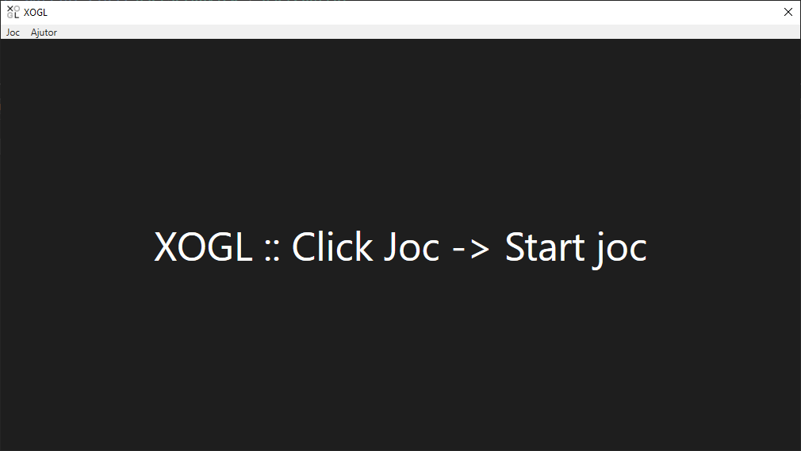
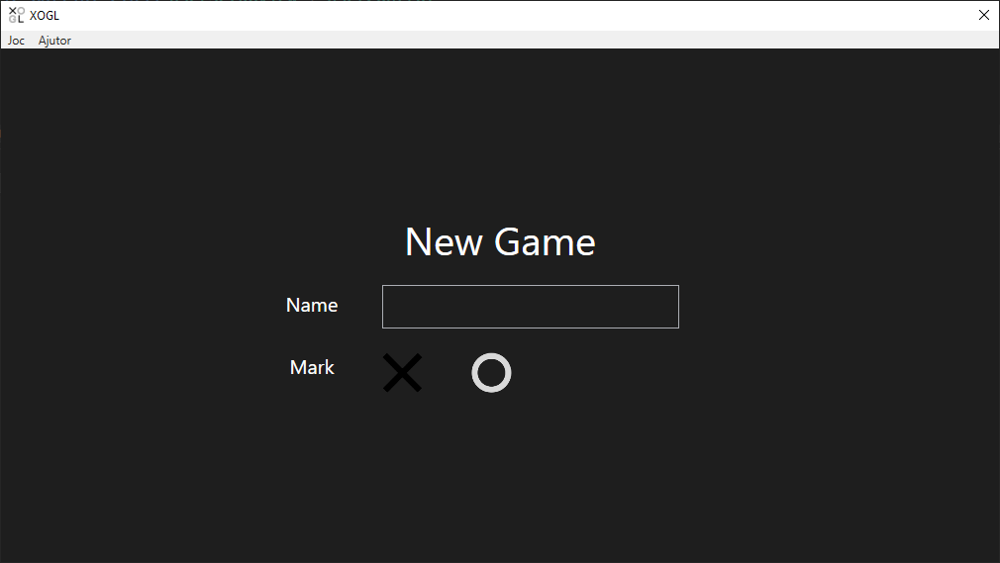
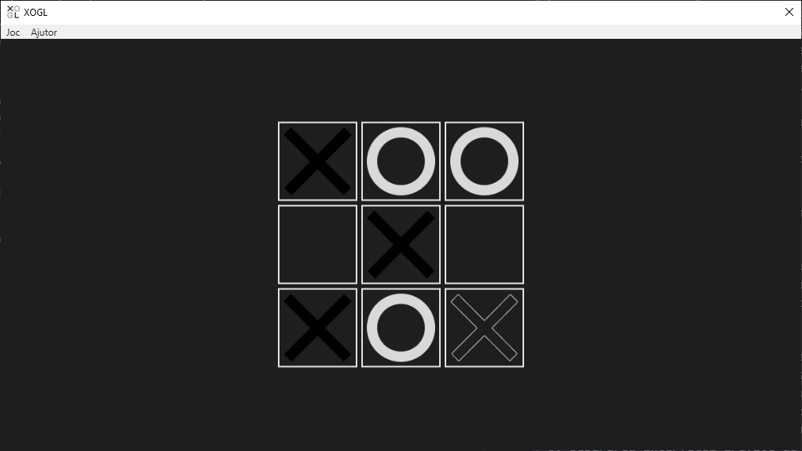

# XOGL

```txt
Tema 1 – MVP ID 

Se cere să se scrie o aplicație reprezentând un Joc “X şi O”. Aplicația va fi 
implementată în limbajul C#, obligatoriu de tip WPF, platforma .NET Framework 4.5+, 
Visual Studio 2019 (sau mai nou). Opțional, aplicația poate fi dezvoltată cu design pattern-ul 
MVVM. 
Va exista un meniu „Joc” cu un submeniu “Start Joc”, şi un meniu „Ajutor”, care va 
conţine un submeniu "Despre", cu: numele studentului, adresa de e-mail, data curentă 
preluată din sistem şi o scurtă descriere a jocului. 
La selectarea din meniul ‚Joc’ a submeniului “Start Joc” se va solicita introducerea 
numelui jucătorului şi a simbolului cu care se doreşte a juca (X sau O).  
Jocul va fi compus dintr-un grid de 3 linii şi 3 coloane, iar la click pe una dintre căsuţe 
se va completa simbolul selectat la început (X sau O). După fiecare simbol plasat manual, 
simbolul opus va fi plasat automat, în mod aleatoriu, pe unul dintre câmpurile rămase, după o 
secundă de aşteptare. Apoi, mutarea jucătorului se va efectua doar atunci când utilizatorul dă 
click pe una dintre căsuţele libere. Aplicaţia trebuie să marcheze vizual jucătorul care este la 
mutare. 
Finalul jocului – la completarea unei linii, coloane sau diagonale cu 3 simboluri alese 
de utilizator, jocul se va încheia cu mesajul: „Numele jucătorului, ai câştigat!;  altfel, la 
completarea unei linii, coloane sau diagonale cu 3 simboluri opuse, se va afişa un mesaj de 
joc pierdut („Numele jucătorului, ai pierdut!”). În cazul în care toate cele 9 căsuţe sunt 
completate şi jocul nu s-a încheiat cu câştig sau pierdere, se va afişa un mesaj de egalitate. 
Barem de notare: 
1. Afişarea meniului şi a tablei de joc (2p) 
2. Interschimbarea corectă a adversarilor (1p) 
3. Completarea la click a simbolului ales de utilizator (1p) 
4. Completarea simbolului opus automat (1p) 
5. Identificare sfârşit de joc (2p) 
6. Separarea interfeţei grafice de funcţionalitate (2p) 
7. Oficiu (1p) 
Tema va fi prezentată în data de 23 martie 2024. 
Succes! 
```

```txt
Project Root
    \_ Assets
        \__ icon.ico
        \__ player_o.png
        \__ player_o_transparent.png
        \__ player_x.png
        \__ player_x_transparent.png
    \_ Models
        \__ Board.cs
        \__ User.cs
        \__ Game.cs
    \_ Resources
        \__ Styles.xaml
    \_ Utils
        \__ GameConstants.xaml
    \_ Views
        \__ UserSetupView.xaml
        \__ UserSetupView.xaml.cs
        \__ GameView.xaml
        \__ GameView.xaml.cs
    \_ App.xaml
    \_ App.xaml.cs
    \_ AssemblyInfo.cs
    \_ MainWindow.xaml
    \_ MainWindow.xaml.cs
```


Start screen


New Game screen


Game screen
