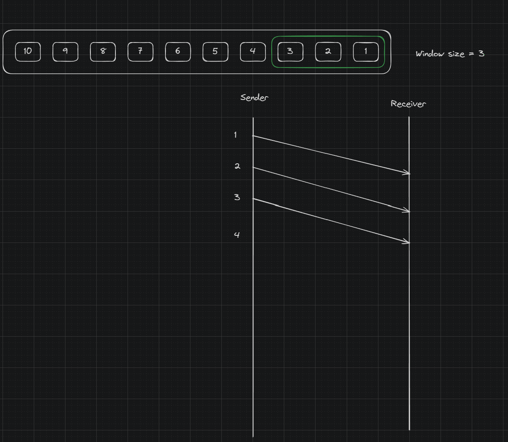

# Examen scris

Subiectul 2:
Se da adresa IP: 118.145.255.255.
a. Carei clase ii apartine adresa data? Ce tip de adresa este?
b. Care este adresa celei de a 900-a gazda din aceasta retea (binar si zecimal)?
c. Determinati numarul minim de biti imprumutati pentru a se crea cel putin 500 de subretele si in fiecare subretea sa existe cel putin 1000 de gazde.
d. In conditiile punctului c, determinati adresa celei de-a 200-a gazde din a 400-a subretea.
e. In conditiile punctului c, determinati adresa subretelei careia ii apartine adresa IP data initial.
f. Scrieti domeniul adreselor gazdelor pentru ultima subretea care se poate forma, in conditiile punctului c.

```txt

a. Carei clase ii apartine adresa data? Ce tip de adresa este?
118.145.255.255 -> 0111 0110. 1001 0001. 1111 1111. 1111 1111

Clasa A - primul bit al primului octet = 0
Tipul adresei: Broadcast
```

```txt

b. Care este adresa celei de a 900-a gazda din aceasta retea (binar si zecimal)?

Adresa Ip:   118.145.255.255
Masca de retea:     255.255.255.0 
Adresa retelei:   118.145.255.0
Adresa de broadcast: 118.145.255.255

118.145.255.255

900 (baza 10) = 0011 1000 0100 (baza 2)

0111 0110. 0000 0000. 0000 0011. 1000 0100 -> 118.0.3.132

```

```txt
c. Determinati numarul minim de biti imprumutati pentru a se crea cel putin 500 de subretele si in fiecare subretea sa existe cel putin 1000 de gazde.

2 <= k <= n-2
2^k - 2 >= 500 /+2
2^(n-k) - 2 >= 1000 /+2

2 <= k <= 22
2^k >= 502
2^(24-k) >= 1002

2^k >= 502 => 2^k >= 2^9 => k >= 9
                            k minim => k = 9
2 <= 9 <= 22 (DA)
2^(24-9) >= 1002 => 2^15 >= 1002 (Adevarat)	

Raspuns: k=9 
```

```txt
d. In conditiile punctului c, determinati adresa celei de-a 200-a gazde din a 400-a subretea.
2^k-2 = 2^9-2 = 500 subretele
2^(n-k) - 2 = 2^24 - 2 = 16,777,214 gazde/subretea

400 (baza 10) = 0001 1001 0000 (baza 2)

0111 0110. 0000 0000. 0000 0001. 1001 0000 -> 118.0.1.144

200 (baza 10) = 1100 1000 (baza 2)

=> a 200-a gazda din a 400-a subretea -> 0111 0110. 0000 0000. 0000 0001.1100 1000
```

```txt
e. In conditiile punctului c, determinati adresa subretelei careia ii apartine adresa IP data initial.

255.255.0.0
```

```txt
f. Scrieti domeniul adreselor gazdelor pentru ultima subretea care se poate forma, in conditiile punctului c.

0111 0110. 1111 1111. 1111 1111. 1111 1110 -> 118.255.255.254
```

Subiectul 3:
Unei organizatii ii este alocat blocul de adrese definit de 150.160.25.225/23.
a. Determinati numarul de adrese alocat acelei organizatii, prima si ultima adresa ale blocului.
b. Daca blocul alocat se imparte in 6 subretele care contin cate 256,  64, 64, 64, 32 si 32 adrese, sa se determine masca, prima si ultima adresa ale fiecarei subretele.


```txt
Clasa B

150.160.25.225 = 1001 0110. 1010 0000. 0001 1001.1111 1111
150.160.25.225/23 = 1001 0110. 1010 0000. 0001 1001. 1110 0001

Adresa retea    : 1001 0110. 1010 0000. 0001 1000. 0000 0000 -> 150.160.24.0
Adresa broadcast: 1001 0110. 1010 0000. 0001 1000. 1111 1111 -> 150.160.25.255
Masca:               1111 1111. 1111 1111. 1111 1111. 1111 1111 -> 255.255.255.0

150.160.25.225/23 -> 2^9 = 512 adrese alocat acelei organizatii
150.160.24.0 -> prima adresa a blocului
150.160.25.255 -> ultima adresa a blocului

6 subretele care contin cate 256,  64, 64, 64, 32 si 32

256 -> 2^8

Masca: 255.255.255.0
Prima: 150.160.24.0
Broadcast: 150.160.24.255

64  -> 2^6

Masca: 255.255.255.192
Prima: 150.160.25.0
Broadcast: 150.160.25.63

32  -> 2^5

Măsca: 255.255.255.224
Prima: 150.160.26.0
Broadcast: 150.160.26.31

```

Subiectul 4:
Descrieti si exemplificati modul de lucru al ferestrei glisante.


Presupunem ca avem urmatoarele date pe care vrem sa le trimitem:
[10, 9, 8, 7, 6, 5, 4, 3, 2, 1] 

Si parametrul window size = 3

La inceput avem urmatorul data frame: (3, 2, 1)

Sender-ul trimite primele 3 pachete de date catre Receiver
Si asteapta acknowledgement-ul



Cand s-a primit acknowledgement-ul pentru pachetul 1 de date, 
fereastra gliseaza catre urmatorul pachet de date, si se asteapta acknowledgement


Procedeul continua pana ce se trimit toate pachetele de date


